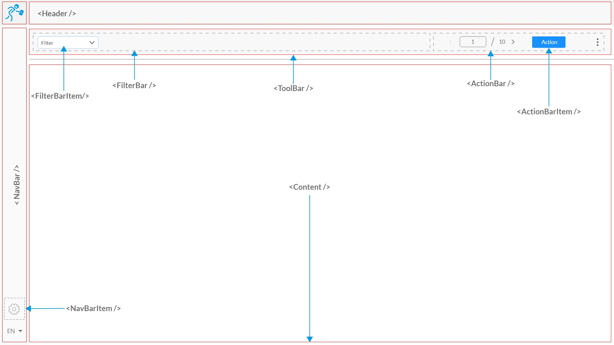

# Contributing to EMIS

:+1::tada: First of all, We would like to thank you for taking your time to contribute here :tada::+1:

The following is a set of guidelines for contributing to EMIS and its modules(packages),
which are hosted in the [codetanzania organization](https://github.com/CodeTanzania/) on GitHub. These are mostly guidelines and not rules.
Use your best judgment, and feel free to propose changes to this document in a pull request.

## Table of Contents

[What Should I know before I get started?](#what-should-i-know-before-get-started)

[How Can I Contribute?](#how-can-i-contribute)

[Styleguides](#styleguides)

- [Redux Actions](#redux-actions)
- [Project Structure](#project-structure)
- [CSS Guideline](#css-guidline)
- [Commit Messages](#git-commit-messages)
- [Layout Guide](#layout-guide)
- [Typography](#typography)

#### 1. <a name="redux-actions">Redux Actions</a>

I this project we have agreed to establish a standard to which we will use to write our redux actions. Inspired by [flux-standard-action](https://github.com/redux-utilities/flux-standard-action) the following convention was established;

Actions types names will be `ACTION(verb)_RESOURCE(noun)_STATE(status)`

e.g

- GET_PLANS_START
- GET_PLAN_START
- GET_USERS_SUCCESS
- GET_USERS_ERROR

> For the verbs we suggest to use http verbs if the action will trigger API client action, i.e GET,PUT,POST,DELETE, etc

```js
// action to start fetching users
{
  type: 'GET_USERS_START',
  meta: {
    page: 1,
    query: '',
    ... any other parameters needed for this action
  }
}
```

```js
// action to handle successful users fetching
{
  type: 'GET_USERS_SUCCESS',
  payload: {
    data: users
  },
  meta: {
      page: 1,
      total: 200,
      query: null,
      ... any other meta info needed
  }
}
```

```js
// action to handle error while fetching users
{
  type: 'GET_USERS_ERROR',
  payload: {
    data: error
  },
  error: true
}
```

```js
// action to handle posting (adding) new user
{
  type:'POST_USER_START',
  payload:{
    data:{}
  },
}
```

For those actions which are not asynchronous, we recommend to use this convention `ACTION_VERB`

```js
// action to handle user select from a redux store
{
 type: 'SELECT_USER',
 payload: {
   data: 3 // userid
 }
}
```

#### 2. <a name="project-structure">Project Structure</a>

#### 3. <a name="css-guideline">CSS Class Names</a>

On writing CSS we agreed to use components namespace to write CSS. Apart from component specific styles, the remaining styles will be under `global.css` file which will contain utility classes and other global classes needed.

e.g of styling a component.

#### 4. <a name="git-commit-messages">Commit Messages</a>

We recommend prefix commit message subject line with the module/section you are working on. e.g
`PlanList: Improve layout responsiveness` then on the details section you can explain what you did on that commit in details. Here are some guidelines to observe while writing commit messages

##### **Commit Message Best Practices**

- Separate subject from body with a blank line.
- Limit the subject line to 50 characters.
- Capitalize the subject line.
- Do not end the subject line with a period.
- Use the imperative mood in the subject line.
- Wrap the body at 72 characters.
- Use the body to explain what and why vs. how.

##### **Examples**

- If applied, this commit will ***refactor subsystem X for readability***.
- If applied, this commit will ***update getting started documentation***.
- If applied, this commit will ***remove deprecated methods***.
- If applied, this commit will ***release version 1.0.0***.
- If applied, this commit will ***merge pull request #123 from user/branch***.

#### 5. <a name="layout-guide">UI Layout Guide</a>
We agreed to use the layout displayed on the image below as the base layout UI for all components.



#### 6. <a name="typography">Project Typography</a>
##### **Font Family**
We use Lato as the main font family for all UI components.

##### **Font Size**
The base font size is 14px. 

Headers will use font sizes as shown below:
 
 h1 - 22px

 h2 - 20px

 h3 - 18px

 h4 - 16px

##### **Line Height**
The line height is 1.6 for all texts
